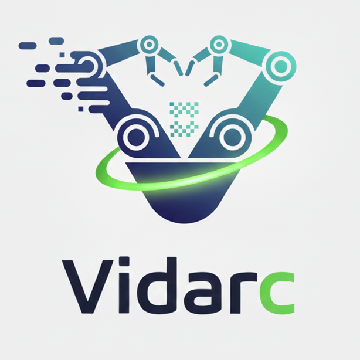

# Vidar & Vidarc Embodied Video Foundation Model



<a href='https://arxiv.org/abs/2507.12898'></a>
<a href='https://openreview.net/forum?id=gsvjCTIYPb'></a>
[](https://embodiedfoundation.github.io/vidar_anypos)
[](https://huggingface.co/Xiang-cd/vidar)


## 📝 Table of Contents
- [🔥 News](#-news)
- [📖 Introduction](#-introduction)
- [🔧 Installation](#-installation)
- [⚡ Inference](#-inference)
- [🖊️ Citation](#%EF%B8%8F-citation)
- [🙏 Acknowledgements](#-acknowledgements)

## 🔥 News
- **[2025.12]**: Initial release of the codebase.
- **[2025.07]**: Vidar paper released on [arXiv](https://arxiv.org/abs/2507.12898).

## 📖 Introduction
### Vidar: Unified Embodied Video Foundation Model for Low-Shot Generalist Manipulation
Vidar is a unified **Embodied Video Diffusion Model** that leverages internet-scale video priors and cross-platform robot trajectory data to address the core issues of data scarcity and platform adaptation in robot manipulation.

Vidar adopts a "Video Generation + Action Decoding" two-stage strategy, integrating two core components — the Embodied Video Diffusion Model and the Masked Inverse Dynamics Model (MIDM). It also achieves robust generalization to unknown tasks, backgrounds, and camera layouts through a Test-Time Scaling strategy with physics-aware re-ranking.

Furthermore, Vidar aligns cross-platform heterogeneous data through a unified observation space (integrating multi-view images, robot types, camera layouts, and task instructions) and employs a "General Pre-training -> Embodied Domain Pre-training -> Target Domain Fine-tuning" three-stage training process. This allows it to capture physical consistency and temporal coherence from massive unlabeled videos, ultimately achieving low-shot adaptation on new robot platforms with only about 20 minutes of human demonstration data.

### Vidarc: Autoregressive Video Foundation Model for Closed-Loop Control
Vidarc is a novel **Autoregressive Embodied Video Diffusion Model** designed specifically for robot closed-loop control, aiming to solve the two core pain points of high latency and insufficient grounding in robot manipulation under data-scarce scenarios.

By fusing autoregressive video generation with the Masked Inverse Dynamics Model, it integrates real-time environmental feedback into the inference process, achieving low-latency, high-precision closed-loop control while maintaining strong generalization and error correction capabilities in unknown robot platforms and dynamic environments.


## 🔧 Installation
Run the following commands:
```bash
conda env create --file vidar.yaml
conda activate vidar
pip install -r requirements.txt
pip install flash-attn --no-build-isolation
```


## ⚡ Inference

Download pre-trained model weights:
[Wan2.2](https://huggingface.co/spaces/Wan-AI/Wan-2.2-5B), and place it in `Wan2.2-TI2V-5B`.
[Vidar/Vidarc](https://huggingface.co/Xiang-cd/vidar), and place it in `vidar_ckpts`.

### Inference with Example
```bash
# Inference with vidarc
output_dir="output/test"
python generate_causal.py \
            --task ti2v-5B \
            --size "640*736" \
            --ckpt_dir ./Wan2.2-TI2V-5B \
            --convert_model_dtype \
            --pt_dir vidar_ckpts/vidarc.pt \
            --dataset_json examples/robotwin_example.json \
            --output_dir "$output_dir"

# Inference with vidar
python generate.py \
    --task ti2v-5B \
    --size "640*736" \
    --ckpt_dir ./Wan2.2-TI2V-5B \
      --convert_model_dtype \
      --pt_dir vidar_ckpts/vidar.pt \
    --dataset_json examples/robotwin_example.json \
    --output_dir "$output_dir"
```

### Robotwin Eval

See [eval code]( https://github.com/thu-ml/vidar-robotwin.git), and setup related environment.
```bash
# clone related code
git clone https://github.com/thu-ml/vidar-robotwin.git

# read related README at vidar-robotwin dir.
```


## 🖊️ Citation
If you find this project helpful for your research, please cite our paper:

```bibtex
@misc{feng2025vidarembodiedvideodiffusion,
      title={Vidar: Embodied Video Diffusion Model for Generalist Manipulation}, 
      author={Yao Feng and Hengkai Tan and Xinyi Mao and Chendong Xiang and Guodong Liu and Shuhe Huang and Hang Su and Jun Zhu},
      year={2025},
      eprint={2507.12898},
      archivePrefix={arXiv},
      primaryClass={cs.LG},
      url={https://arxiv.org/abs/2507.12898}, 
}

```

## 🙏 Acknowledgements
This project references the following open-source projects, we would like to express our gratitude:
- [Wan2.2](https://github.com/Wan-Video/Wan2.2/)

